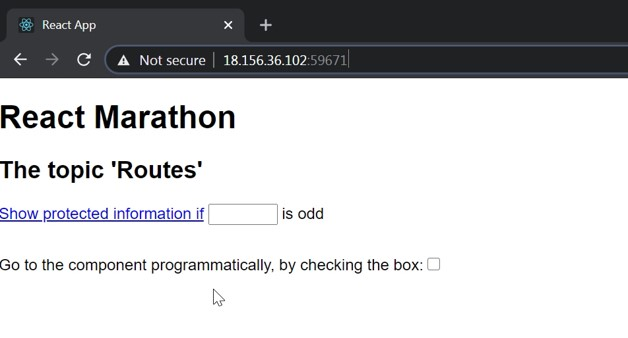
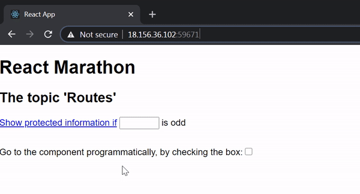
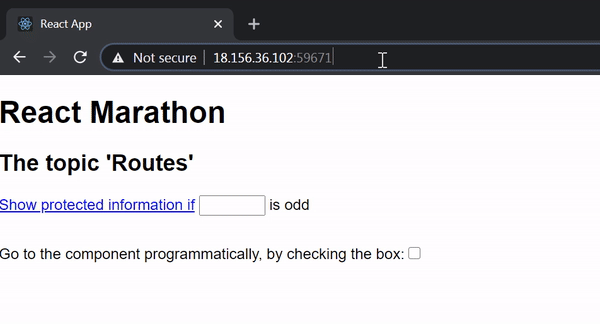
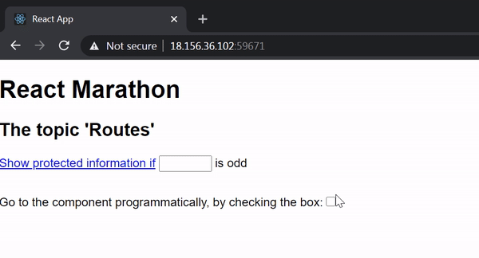

# React online marathon

## The tasks of the topic "Routes"

There is an application that looks like:

<kbd>
  
</kbd>

\
Provide for this application `routes` to do next subtasks:

1. Create the path `/subtask1` with parameter. After navigating to this path the application renders
`div` element with text `Subtask1, parameter:` and value of parameter. E.g. routing to `/subtask1/2`
renders `Subtask1, parameter: 2` in an `div` element.

\
&nbsp;&nbsp;
   <kbd>
    
   </kbd>

2. Create the path `/subtask2` with query. After navigating to this path the application renders
`div` element with text `Subtask2, query parameters:` and values of all query parameters separated by comma.
E.g. routing to `/subtask2?author=alan&age=20` renders `Subtask2, query parameters: author=alan, age=20`
in an `div` element.

\
&nbsp;&nbsp;
   <kbd>
    
   </kbd>

3. Create the path `/subtask3` with guard. If you click on link [Show protected information if]() and if,
at the same time, a number entered in the `input` is odd, the application navigates to `/subtasks3` and renders
`div` element with text `Subtask3, protected information`

\
&nbsp;&nbsp;
   <kbd>
    
   </kbd>

4. Create the path `/subtask4` which can be navigated programmatically as well as through address bar.
Programmed route is triggered when user sets value of the check box to `checked`. After navigating to this path the application renders
`div` element with text `Subtask4, navigated programmatically`

\
&nbsp;&nbsp;
   <kbd>
    
   </kbd>
